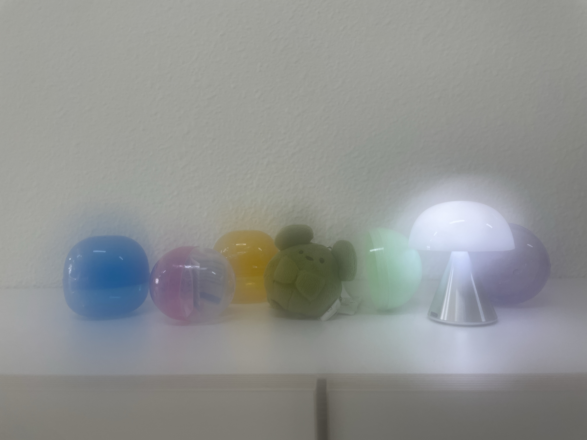
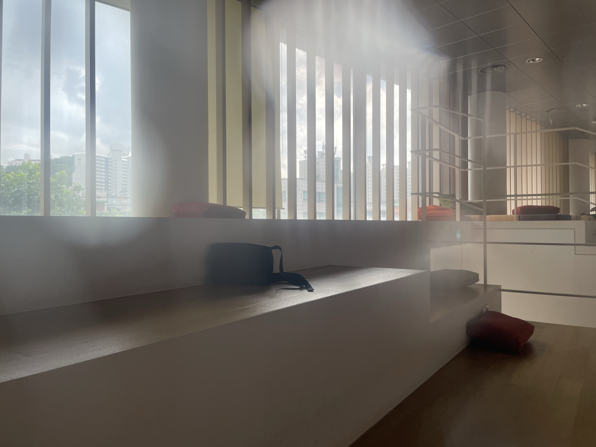
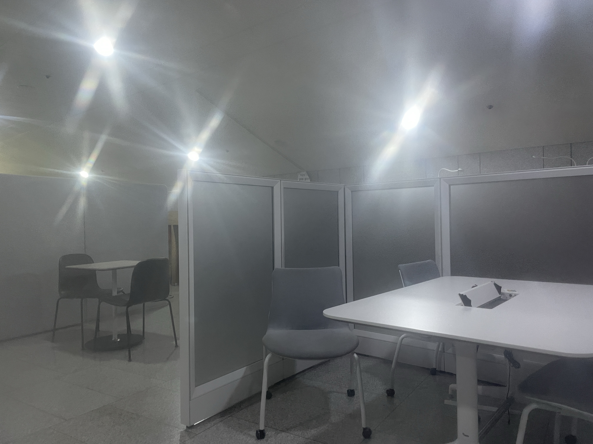
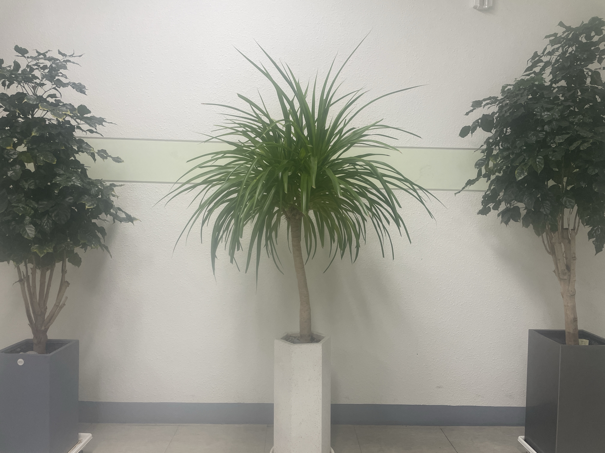
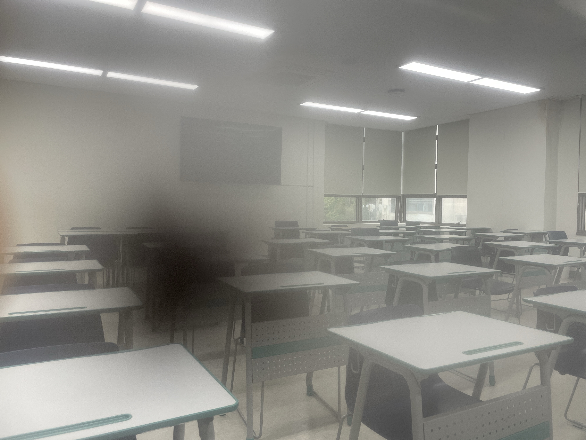
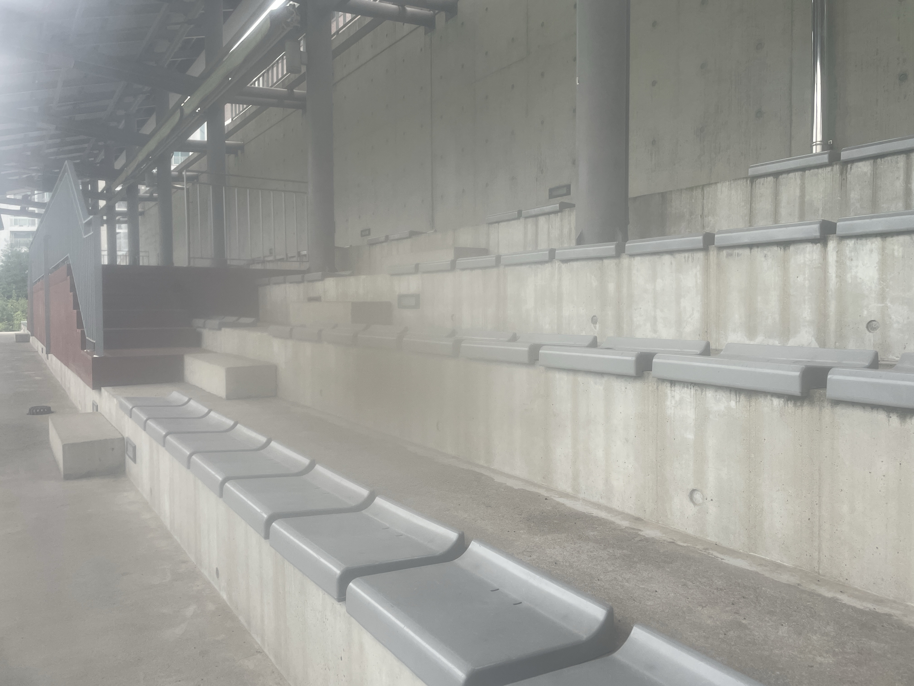
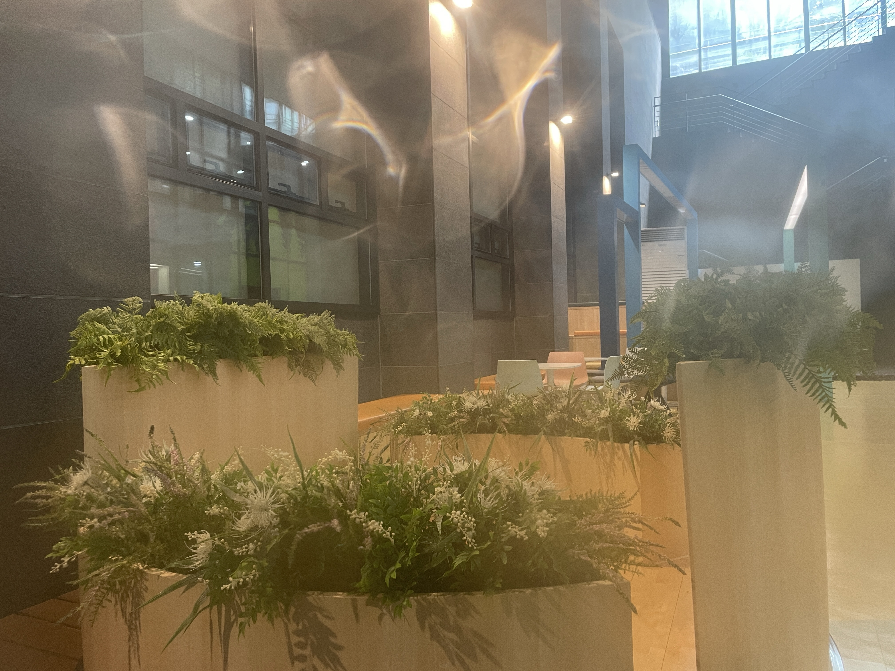
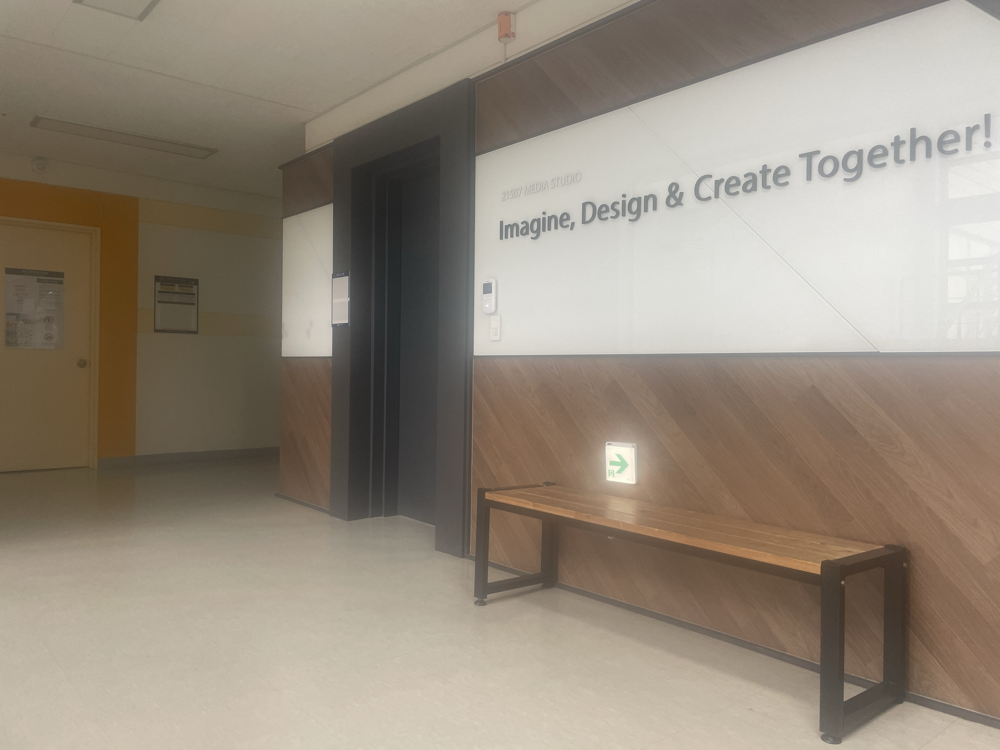

<!-- 페이지 전역 스타일 (이 페이지에서만 적용) -->
<style>
.gallery-wrapper .image img {
  width: 100%;
  transition: width 0.3s ease;
}
.gallery-wrapper .image img:hover {
  position: relative;
  width: 1064px !important;
  z-index: 10;
}
</style>

<hr>

<div class="gallery-wrapper">
  <div class="columns is-multiline">

    <div class="column is-2"><figure class="image"></figure></div>
    <div class="column is-2"><figure class="image"></figure></div>
    <div class="column is-2"><figure class="image"></figure></div>
    <div class="column is-2"><figure class="image"></figure></div>
    <div class="column is-2"><figure class="image"></figure></div>
    <div class="column is-2"><figure class="image"></figure></div>

    <div class="column is-2"><figure class="image"></figure></div>
    <div class="column is-2"><figure class="image"></figure></div>
    <div class="column is-2"><figure class="image"></figure></div>
    <div class="column is-2"><figure class="image"></figure></div>
    <div class="column is-2"><figure class="image"></figure></div>
    <div class="column is-2"><figure class="image"></figure></div>

    <div class="column is-2"><figure class="image"></figure></div>
    <div class="column is-2"><figure class="image"></figure></div>
    <div class="column is-2"><figure class="image"></figure></div>
    <div class="column is-2"><figure class="image"></figure></div>
    <div class="column is-2"><figure class="image"></figure></div>
    <div class="column is-2"><figure class="image"></figure></div>

    <div class="column is-2"><figure class="image"></figure></div>
    <div class="column is-2"><figure class="image"></figure></div>
    <div class="column is-2"><figure class="image"></figure></div>
    <div class="column is-2"><figure class="image"></figure></div>
    <div class="column is-2"><figure class="image"></figure></div>
    <div class="column is-2"><figure class="image"></figure></div>

  </div>
</div>

## SIDL Dataset  
We provide 80% of the scenes for training and learning. The remaining scenes are used for online evaluation.

### Patchify images (512×512)  
For efficient training and learning, we provide patchified images.  
<div class="buttons" style="text-align: center; margin-top: 1em;">
  <a class="button is-primary" href="https://drive.google.com/file/d/1es3rPo5Y9O96EjDVXanUY8NpaRprWH-h/view?usp=sharing" target="_blank">Train</a>
  <a class="button is-primary" href="https://drive.google.com/file/d/1u5-MDauO3XolXsU6eOARwlXo7SnpLwqA/view?usp=sharing" target="_blank">Validation</a>
  <a class="button is-primary" href="https://drive.google.com/file/d/1-SFyyjH0G3C68OfDjZ_O7M4mOqkcJdEf/view?usp=sharing" target="_blank">Test</a>
</div>

### Full-resolution images (4032×3024)  
<div class="buttons" style="text-align: center; margin-top: 1em;">
  <a class="button is-primary" href="https://drive.google.com/file/d/1s_gUw1DCqokihl3YtO3lu9_GnLZaSElI/view?usp=sharing" target="_blank">Train</a>
  <a class="button is-primary" href="https://drive.google.com/file/d/1OHxG8Jh0goKIhkJTe9NXZ6uIuD5qVaNH/view?usp=sharing" target="_blank">Validation</a>
</div>

### RAW files  
We also provide RAW image files (DNG) along with metadata.  
<div class="buttons" style="text-align: center; margin-top: 1em;">
  <a class="button is-primary" href="https://drive.google.com/file/d/1k78IIsUl2eYPnPvWkBampU0qlMrW4F-u/view?usp=sharing" target="_blank">DNG images</a>
  <a class="button is-primary" href="https://drive.google.com/file/d/1lAab5F3jjCByY4OEvGSAfykyAqp2wfTi/view?usp=sharing" target="_blank">Metadata</a>
</div>

### Online Evaluation  
<div class="buttons" style="text-align: center; margin-top: 1em;">
  <a class="button is-primary" href="http://203.253.25.170:8080" target="_blank">Click here to launch evaluation</a>
</div>

Click the button above to evaluate your model on the SIDL benchmark.

### ISP pipeline  
Coming soon

### Citation  
```bibtex
@inproceedings{choi2025sidl,
  title     = {SIDL: A Real-World Dataset for Restoring Smartphone Images with Dirty Lenses},
  author    = {Choi, Sooyoung and Park, Sungyong and Kim, Heewon},
  booktitle = {Proceedings of the AAAI Conference on Artificial Intelligence},
  volume    = {39},
  number    = {3},
  pages     = {2545--2554},
  year      = {2025}
}
